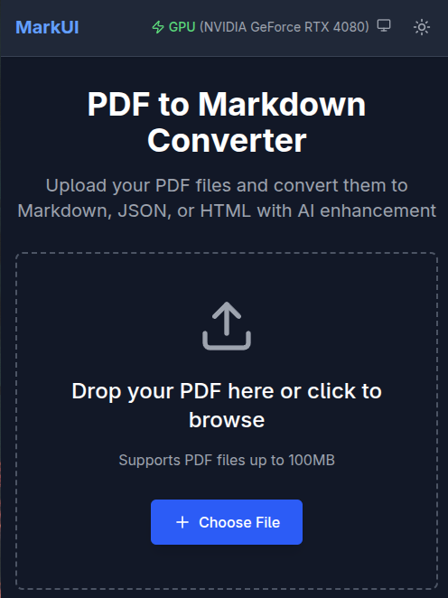
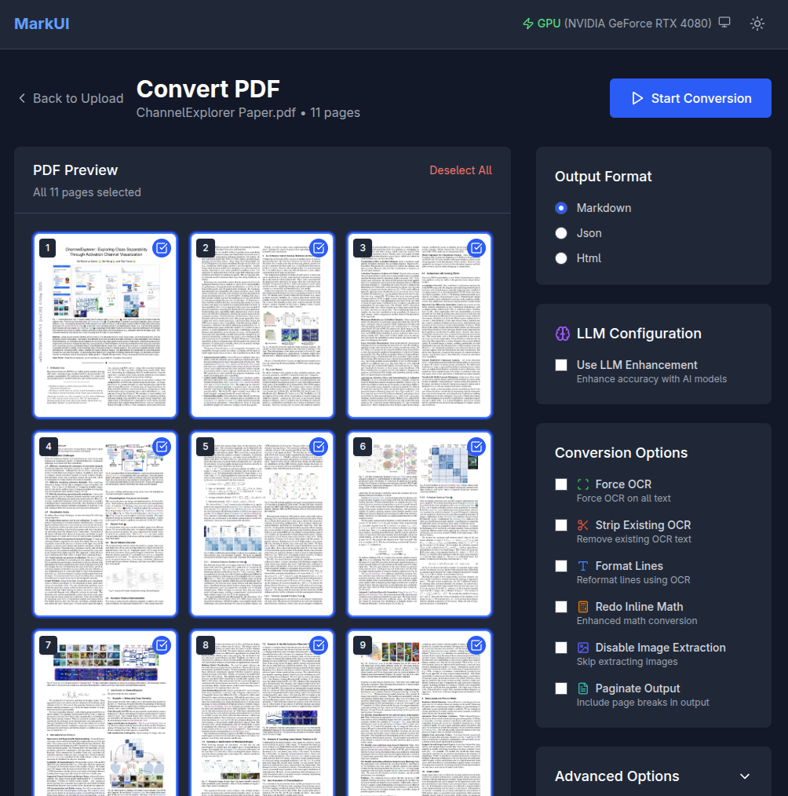
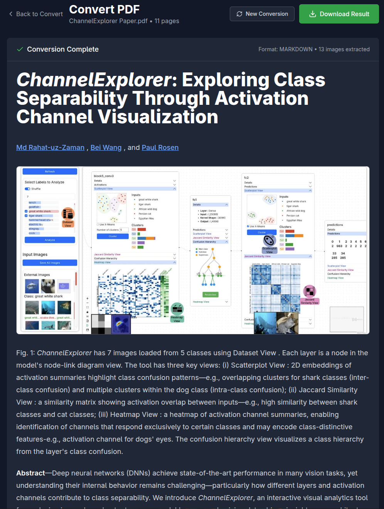

# MarkUI - PDF to Markdown Converter

A modern, full-stack application for converting PDF documents to Markdown, JSON, and HTML with AI enhancement using the [marker library](https://github.com/VikParuchuri/marker).





## 🏗️ Architecture

### Backend (FastAPI)
- **Framework**: FastAPI with async support
- **Processing**: Marker library integration with background jobs
- **LLM Support**: Multiple AI service integrations
- **API**: RESTful API with comprehensive endpoints
- **Redis**: Redis for job queuing and caching

### Frontend (Svelte 5)
- **Framework**: SvelteKit with TypeScript
- **Styling**: Tailwind CSS 4 with custom components
- **State**: Svelte stores for global state management
- **UI**: Modern, accessible interface with Lucide icons

## 📦 Usage

Docker is the recommended way to run MarkUI. Currently only the GPU version is uploaded to Docker Hub. You will need a redis server running somewhere.

```bash
docker run -d --name markui -p 80:80 -e REDIS_URL=redis://localhost:6379 markui
```

Open the app in your browser at `http://localhost:80`. For API documentation and usage, see `/docs` when running the server or visit `http://localhost:8000/docs`.

## 📦 Installation

### Prerequisites
- Python 3.10+
- Node.js 22+
- pnpm (recommended)

### Backend Setup

1. **Navigate to backend directory**:
   ```bash
   cd backend
   ```

2. **Install Poetry**:
   ```bash
   curl -sSL https://install.python-poetry.org | python3 -
   ```

3. **Install dependencies**:
   ```bash
   poetry install --no-root
   ```

4. **Configure environment**:
   ```bash
   cp .env.example .env
   # Edit .env with your API keys and settings
   ```

5. **Run the backend**:
   ```bash
   cd backend
   poetry run python run.py
   ```

### Frontend Setup

1. **Navigate to frontend directory**:
   ```bash
   cd frontend
   ```

2. **Install dependencies**:
   ```bash
   pnpm install
   ```

3. **Start development server**:
   ```bash
   pnpm dev
   ```

4. **Open your browser**:
   Navigate to `http://localhost:5173`


## 📁 Project Structure

```
MarkUI/
├── backend/                 # FastAPI backend
│   ├── app/
│   │   ├── api/            # API routes
│   │   ├── core/           # Configuration & database
│   │   ├── models/         # Database models
│   │   ├── schemas/        # Pydantic schemas
│   │   └── services/       # Business logic
│   ├── pyproject.toml      # Python dependencies
│   └── README.md
├── frontend/               # Svelte 5 frontend
│   ├── src/
│   │   ├── lib/           # Utilities & stores
│   │   ├── routes/        # SvelteKit pages
│   │   └── app.css        # Global styles
│   ├── package.json       # Node dependencies
│   └── README.md
└── README.md              # This file
```

## 🤝 Contributing

Just make a PR.

## 📄 License

MIT License - see [LICENSE](LICENSE) file for details.

## 🙏 Acknowledgments

- [Marker](https://github.com/VikParuchuri/marker) - PDF conversion engine
- [FastAPI](https://fastapi.tiangolo.com/) - Backend framework
- [Svelte](https://svelte.dev/) - Frontend framework
- [Tailwind CSS](https://tailwindcss.com/) - Styling framework
